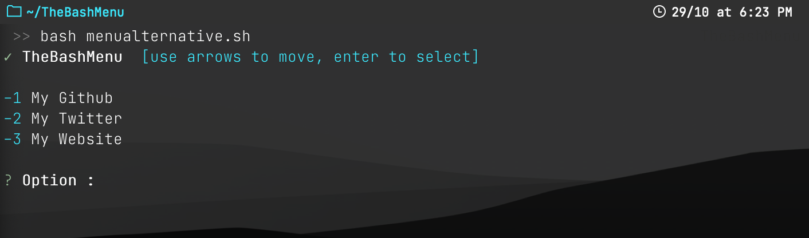

# The Bash Menu [v1.1]

#### A very useful script allowing you to create your own menu.
<p>Create your own beautiful menu with a simple bash file, add a title, a subtitle, your options and your commands!</p>

### Informations:
<p>There is a file named "elements.sh" containing different examples of input, output, reading functions in the same graphic style as "bmenu". You will also find "menuexample.sh", feel free to modify it to create your first bmenu. Once modified, type "bash menuexample.sh" to try it.</p>
<p>Work on : MacOs, KaliLinux [Probably more, tell me if that's the case]</p>

### Install:
```bash
git clone https://github.com/hadrienaka/TheBashMenu
cd TheBashMenu
bash install.sh
```

### Create Your Own Menu :


<p> Create a new bash file (.sh), then paste:</p>

```bash
source bmenu -t "Menu Title" -s "[SubTitle]" -o "Option 1,Option 2,Option 3"

case ${selected} in
	1) TypeYourCommandHere;;
	2) TypeYourCommandHere;;
	3) TypeYourCommandHere;;
esac
```

```diff
! Put a comma between each options (--option | -o)
! The variable need to be call "selected".
```

### Arguments:

```diff
! Arguments :

-h, --help               Show brief help
-t, --title              Edit the title
-s, --subtitle           Edit the subtitle
-o, --option             Edit all the options (Put a comma between them)
-a, --alternative        Display an alternative menu (Put -a at the end of the command)
-u, --update             Update bmenu

```

### Alternative Menu


<p> The alternative menu may be a better choice when you have more than 10 options </p>
<p> To display an alternative menu, just add "-a" or "--alternative" at the end of your command. </p>


