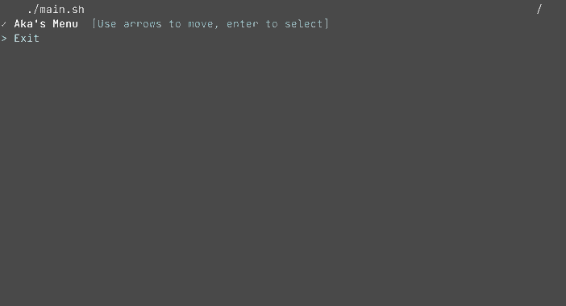

# The Bash Menu

#### A very useful script allowing you to create your own menu.


### How it works:
<p>Press the up or down keys to navigate on the menu and press enter to validate.</p>

-> Work on MacOs, Kali Linux, tell me if you have some issues with another os.

### Install:
```bash
git clone https://github.com/hadrienaka/TheBashMenu
cd TheBashMenu
bash install.sh
```

### Settings:

<p>When you are on your menu, simply press the right arrow on your keyboard to go on the settings.</p>
<p>Here, you can :
  -Create a new option
  -Delete a option
  -Modify the command linked to the option
  -Change title
</p>

#### Follow me on [![Twitter][1.2]][1] or on [![Github][6.1]][6]
[1.2]: http://i.imgur.com/tXSoThF.png (twitter icon without padding)
[6.1]: http://i.imgur.com/0o48UoR.png (github icon with padding)
[1]: https://twitter.com/hadrienaka
[6]: http://www.github.com/hadrienaka
